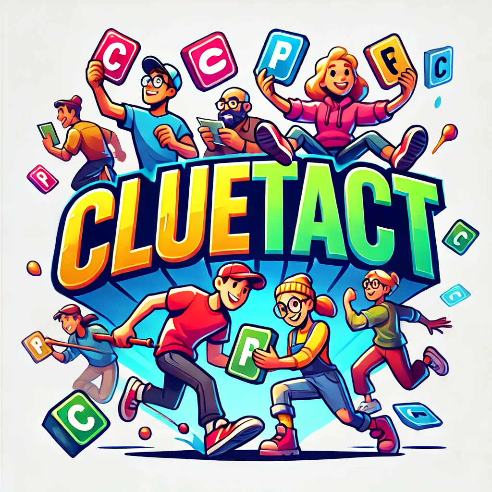

# 🧩 Cluetact

Cluetact is a fast-paced, real-time multiplayer word game where players race to solve clues before their opponents. Built with React, Node.js, and Socket.IO, it's designed to be competitive, fun, and responsive on both desktop and mobile.

## 🚀 Features

- Real-time multiplayer gameplay
- Login and registration system
- Game lobby with matchmaking and room system
- Custom user avatars and profiles
- Playful and modern design

## 🛠 Tech Stack

- **Frontend:** React, React Router, CSS Modules
- **Backend:** Node.js, Express, Socket.IO
- **Database:** MongoDB
- **Session/Cache:** Redis
- **Authentication:** Passport.js with email and social login

## 📦 Installation

- TBD

© 2025 Cluetact — built with love as part of a college project. Please don’t reuse the name or logo without asking. 
